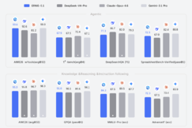
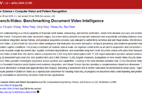

# 文章库 ｜ 机器之心
> 原文链接: https://www.jiqizhixin.com/articles

---

文章库

登录

神仙打架的2026，我们到底该看什么？CVPR线下分享会即将开启

今天

CVPR 2026 论文分享会

OpenClaw太贵？QuantClaw帮你挑精度，成本砍掉21%，还能提速15%

今天

华为

Openclaw

QuantClaw

活久见，时代少年团给大模型上了一课

今天

MiniMax

价值模型不是没用，是架构不对！生成式Critic重新定义LLM强化学习信用分配

今天

生成式 Critic

信用分配（credit assignment）

波士顿动力和谷歌DeepMind为机器人带来具身AI推理

今天

AI for Science

谷歌

OpenAI翁家翌：梯度之外，下一个AI训练范式有着落了？

今天

OpenAI

翁家翌

Heuristic Learning

曝DeepSeek融资500亿元：梁文锋自掏四成，估值飙至3500亿

今天

梁文锋

DeepSeek

VLA的PyTorch时刻已至！港科大联手社区开源StarVLA：一个框架揭秘所有主流VLA

今天

StarVLA

香港科技大学

百度发布文心 5.1：搜索能力登顶国内，预训练成本仅为业界 6%

今天

文心大模型 5.1

百度

WWW 2026｜让MoE路由拥有「记忆」：RMS-MoE用检索记忆协同实现更高效专家调度

今天

RMS-MoE

WWW 2026

上智院联合复旦等开源 BARD-VL：多模态Diffusion模型新SOTA

今天

BARD-VL

BARD（Bridging Autoregressive and Diffusion）

直播预约 | 数据引擎：具身智能的下一个决胜局

05月08日

数据引擎

具身智能

CVPR 2026 Highlight | 清华打破多模态音频生成的「通才困境」：Omni2Sound 音频基础模型开源！

05月08日

Omni2Sound

CVPR 2026 Highlight

拿下1亿美元种子轮！SGLang团队创立RadixArk，打造下一代开放AI基础设施

05月08日

AI 基础设施

RadixArk

OpenAI官方CLI上线，跟复杂的SDK说拜拜

05月08日

openai-cli

OpenAI

ICLR 2026 I 英伟达 & 普渡大学用agent闭环实现文生3D

05月08日

Scenethesis

ICLR 2026

海信密集发布AI硬件，最轻的AI设备只有26.5克，最重的野心是全场景

05月08日

奇富科技发布FCMBench-Video：从“看懂证件”到“看穿过程”，树立视频反欺诈评测新标杆

05月08日

FCMBench-Video-V1.0

奇富科技

破案了！为啥ChatGPT老想着「稳稳地接住你」

05月08日

ChatGPT

陈博远

不用再学AI了！生成结果包稳的Agent来了

05月08日

Agent

胖鹅 AI

已订阅文章库？点此 登录

订阅文章库，解锁 29578 篇文章阅读

已追踪 AI 发展 4146 天，29578 篇原创内容