# 量子位
> 原文链接: https://www.qbitai.com

---

[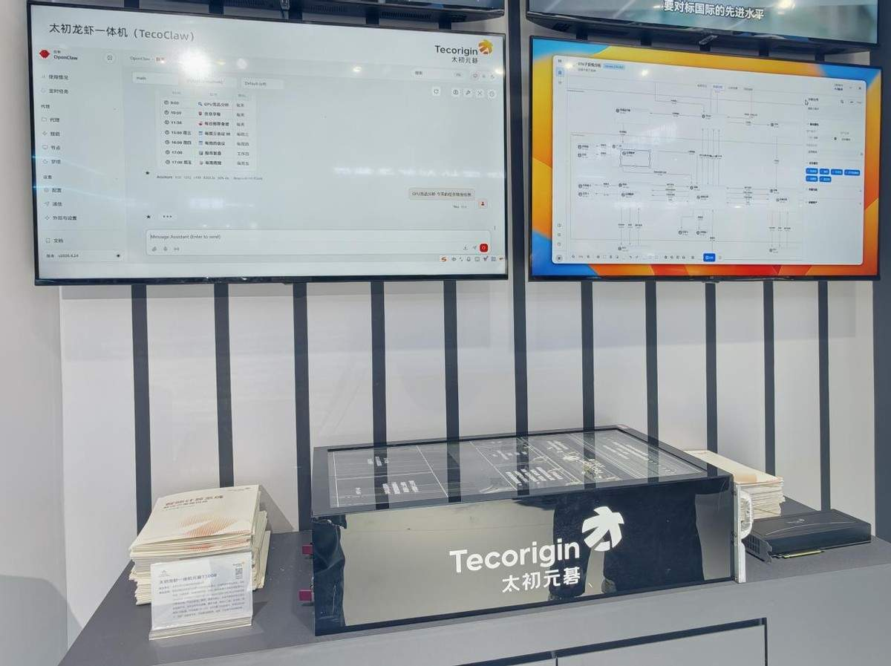](https://www.qbitai.com/2026/05/415027.html)

#### [太初元碁携龙虾一体机亮相北京科博会](https://www.qbitai.com/2026/05/415027.html)

[量子位](https://www.qbitai.com/?author=19) 1小时前

[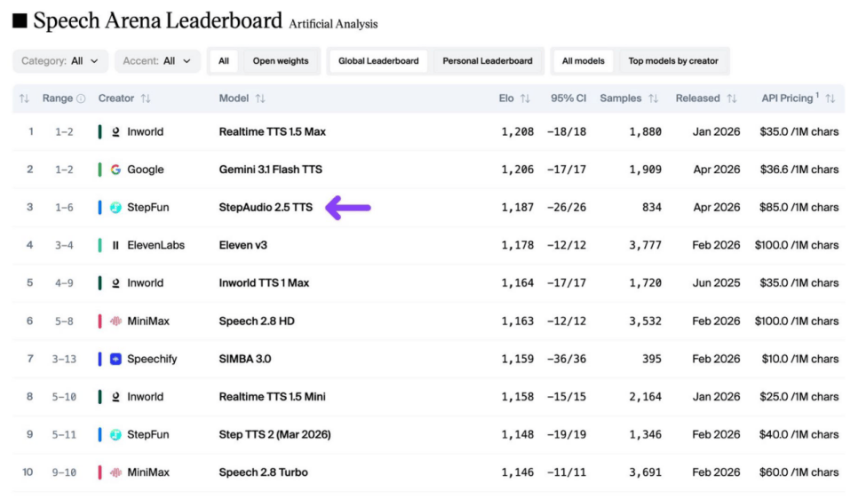](https://www.qbitai.com/2026/05/415023.html)

#### [阶跃最新语音模型位列 Artificial Analysis 评测榜中国第一](https://www.qbitai.com/2026/05/415023.html)

[量子位](https://www.qbitai.com/?author=19) 3小时前

#### [两项AI政策发布，范式智能战略布局与产业方向高度契合](https://www.qbitai.com/2026/05/415019.html)

围绕电力交易、能源调度、智能预测与决策等场景探索AI应用落地

[量子位](https://www.qbitai.com/?author=19) 4小时前

[范式智能](https://www.qbitai.com/tag/%e8%8c%83%e5%bc%8f%e6%99%ba%e8%83%bd)

[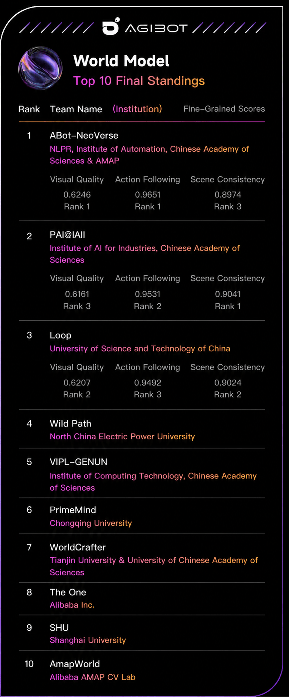](https://www.qbitai.com/2026/05/414826.html)

#### [空间智能的“具身化”跃迁，高德ABot体系模型夺冠AGIBot全球挑战赛](https://www.qbitai.com/2026/05/414826.html)

以0.829的总成绩荣登榜首

[量子位](https://www.qbitai.com/?author=19) 4小时前

[高德ABot](https://www.qbitai.com/tag/%e9%ab%98%e5%be%b7abot)

[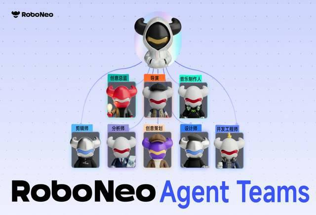](https://www.qbitai.com/2026/05/415010.html)

#### [美图RoboNeo全新升级：首创影像创作Agent Teams](https://www.qbitai.com/2026/05/415010.html)

打造“赛博乙方天团”

[量子位](https://www.qbitai.com/?author=19) 4小时前

[RoboNeo](https://www.qbitai.com/tag/roboneo) [美图公司](https://www.qbitai.com/tag/%e7%be%8e%e5%9b%be%e5%85%ac%e5%8f%b8)

#### [谷歌「AI联合数学家」来了！刷新最难数学AI基准SOTA，牛津教授用它解开群论悬案](https://www.qbitai.com/2026/05/414788.html)

谷歌AI for Math迈出最新一步

[听雨](https://www.qbitai.com/?author=47859) 6小时前

[AI](https://www.qbitai.com/tag/ai) [谷歌](https://www.qbitai.com/tag/%e8%b0%b7%e6%ad%8c)

[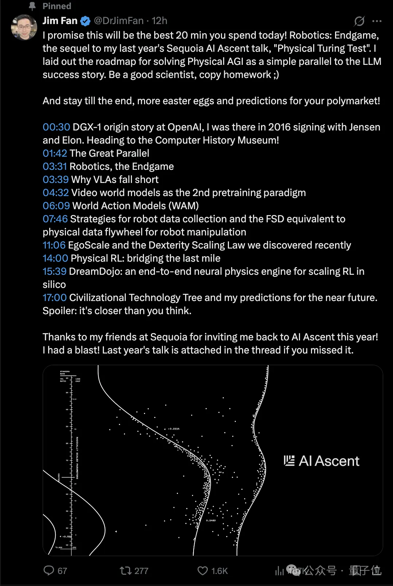](https://www.qbitai.com/2026/05/414547.html)

#### [VLA死了，遥操也死了！英伟达机器人一号位说的](https://www.qbitai.com/2026/05/414547.html)

Jim Fan全新暴论出炉

[henry](https://www.qbitai.com/?author=47850) 7小时前

[VLA](https://www.qbitai.com/tag/vla) [世界模型](https://www.qbitai.com/tag/%e4%b8%96%e7%95%8c%e6%a8%a1%e5%9e%8b) [英伟达](https://www.qbitai.com/tag/%e8%8b%b1%e4%bc%9f%e8%be%be)

[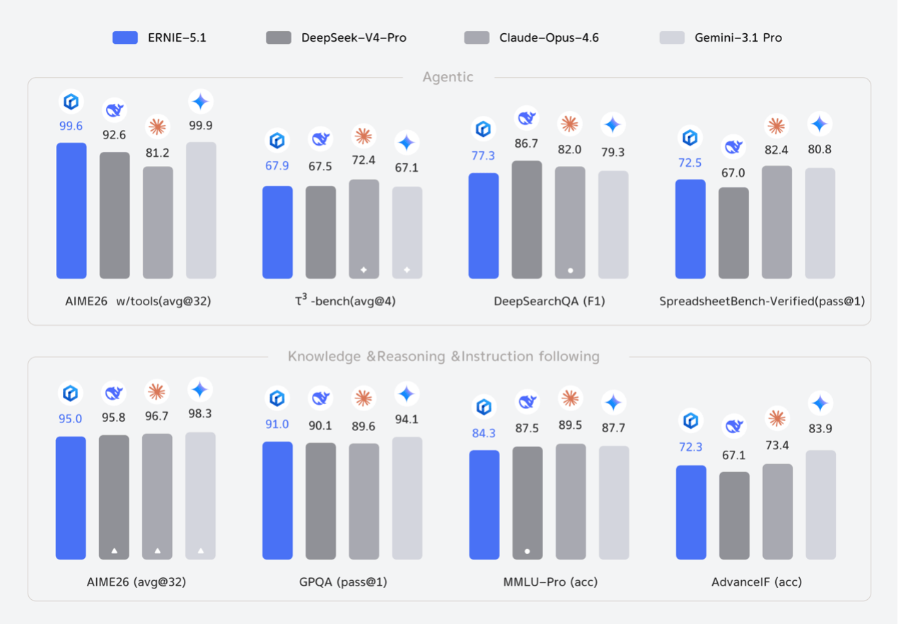](https://www.qbitai.com/2026/05/414496.html)

#### [百度发布文心 5.1：搜索能力登顶国内，预训练成本仅为业界 6%](https://www.qbitai.com/2026/05/414496.html)

搜索、知识、Agent 能力全面提升

[量子位](https://www.qbitai.com/?author=19) 10小时前

[文心5.1](https://www.qbitai.com/tag/%e6%96%87%e5%bf%835-1) [百度](https://www.qbitai.com/tag/%e7%99%be%e5%ba%a6)

#### [打破科技数据壁垒！智会心研官宣：高级检索+AI深度分析，面向个人免费开放！](https://www.qbitai.com/2026/05/414445.html)

智会心研面向个人用户免费开放高级检索与 AI 深度分析核心功能，涵盖专利 AI 检索、AI 伴读、图表分析及多智能体协作，助力研发与情报分析高效完成，降低技术创新门槛。

[允中](https://www.qbitai.com/?author=15) 11小时前

[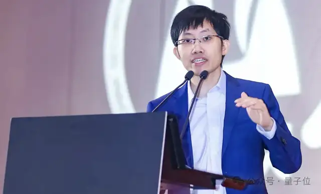](https://www.qbitai.com/2026/05/414432.html)

#### [梁文锋出资200亿！DeepSeek首轮创纪录融资500亿，V4.1定档6月](https://www.qbitai.com/2026/05/414432.html)

如果最终落地，这会是中国大模型公司有史以来最大的一轮融资

[梦晨](https://www.qbitai.com/?author=32) 12小时前

[Deepseek](https://www.qbitai.com/tag/deepseek)

#### [持续领跑！商汤大装置稳居中国MaaS市场第一梯队](https://www.qbitai.com/2026/05/414428.html)

位列第二

[量子位](https://www.qbitai.com/?author=19) 昨天 19:09

[IDC](https://www.qbitai.com/tag/idc) [商汤科技](https://www.qbitai.com/tag/%e5%95%86%e6%b1%a4%e7%a7%91%e6%8a%80) [大装置](https://www.qbitai.com/tag/%e5%a4%a7%e8%a3%85%e7%bd%ae)

#### [一场“无电视”的发布会，揭开海信视像第二增长曲线](https://www.qbitai.com/2026/05/414814.html)

“双战略引擎”赋能全场景覆盖

[量子位](https://www.qbitai.com/?author=19) 昨天 17:35

[海信](https://www.qbitai.com/tag/%e6%b5%b7%e4%bf%a1)

[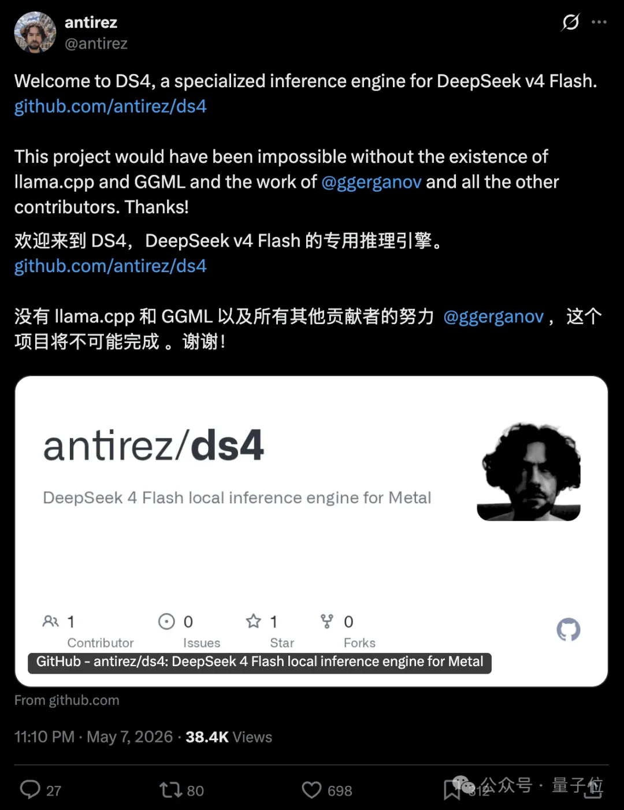](https://www.qbitai.com/2026/05/414316.html)

#### [Redis之父下场，给DeepSeek V4单独造了一台推理引擎](https://www.qbitai.com/2026/05/414316.html)

Mac上就能本地跑deepseek

[henry](https://www.qbitai.com/?author=47850) 昨天 16:20

[Deepseek](https://www.qbitai.com/tag/deepseek)

[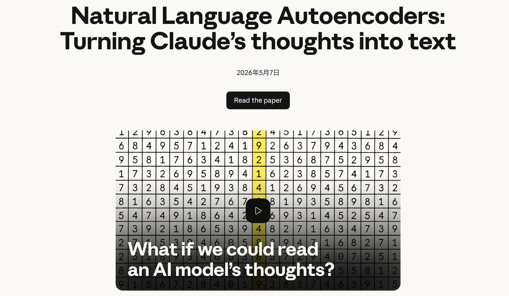](https://www.qbitai.com/2026/05/414213.html)

#### [Anthropic出手！AI的内心独白，曝光了](https://www.qbitai.com/2026/05/414213.html)

原来Claude早就识破了人类的套路（doge）

[一水](https://www.qbitai.com/?author=47840) 昨天 14:34

[Claude](https://www.qbitai.com/tag/claude)

[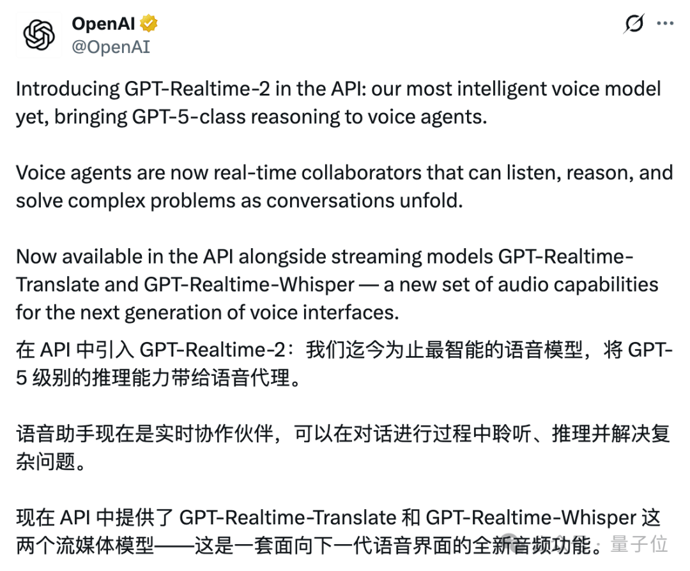](https://www.qbitai.com/2026/05/414194.html)

#### [GPT-5级推理能力塞进语音模型，OpenAI把同传翻译成本砍穿地板价](https://www.qbitai.com/2026/05/414194.html)

OpenAI上新三款实时语音模型

[听雨](https://www.qbitai.com/?author=47859) 昨天 12:35

[OpenAI](https://www.qbitai.com/tag/openai)

#### [特斯拉百万年薪招数据标注员，朝九晚五，无需AI经验](https://www.qbitai.com/2026/05/414156.html)

服务FSD和Optimus

[听雨](https://www.qbitai.com/?author=47859) 昨天 12:25

[AI](https://www.qbitai.com/tag/ai) [特斯拉](https://www.qbitai.com/tag/%e7%89%b9%e6%96%af%e6%8b%89)

[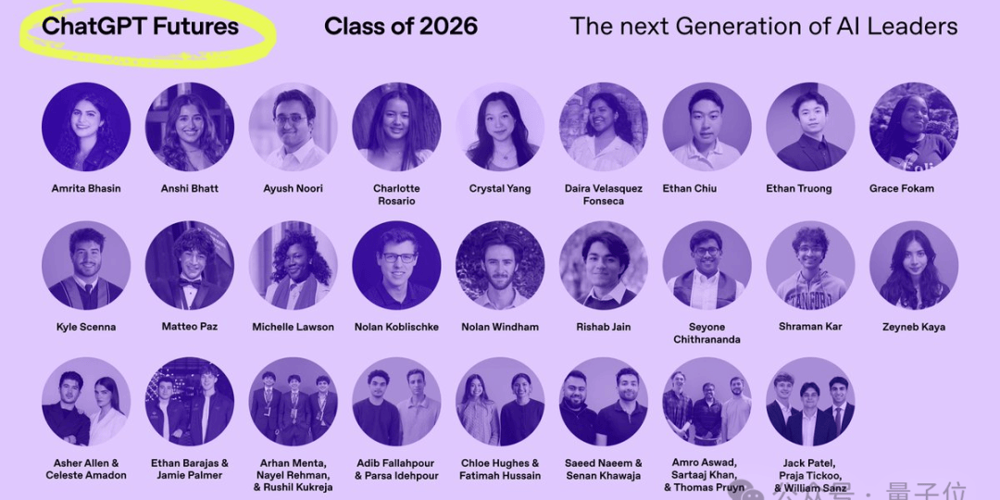](https://www.qbitai.com/2026/05/414125.html)

#### [第一批「AI原生」本科生，要毕业了](https://www.qbitai.com/2026/05/414125.html)

全部都是AI加持的超级个体

[Jay](https://www.qbitai.com/?author=47853) 昨天 12:06

#### [00后下场整顿Agent：啥都不学就能用好AI，这才是正确打开方式](https://www.qbitai.com/2026/05/413612.html)

低提示词，挑战主流模型的交互逻辑

[邓思邈](https://www.qbitai.com/?author=50) 前天 15:14

[00后](https://www.qbitai.com/tag/00%e5%90%8e) [Agent](https://www.qbitai.com/tag/agent) [胖鹅AI](https://www.qbitai.com/tag/%e8%83%96%e9%b9%85ai)

#### [一年磨一剑，今年最炸机器人Demo来了！](https://www.qbitai.com/2026/05/413830.html)

1亿美元种子轮团队出手，单个模型解锁单手打蛋解魔方弹钢琴

[henry](https://www.qbitai.com/?author=47850) 前天 14:43

[具身智能](https://www.qbitai.com/tag/%e5%85%b7%e8%ba%ab%e6%99%ba%e8%83%bd) [机器人](https://www.qbitai.com/tag/%e6%9c%ba%e5%99%a8%e4%ba%ba)

[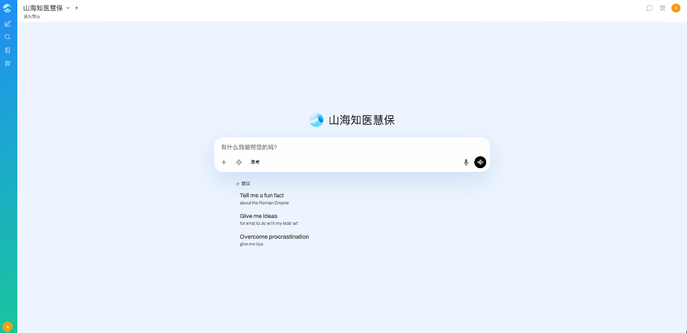](https://www.qbitai.com/2026/05/413782.html)

#### [云知声山海知医慧保大模型重磅发布：以高密智能深耕高价值场景，重构医疗保险数智新生态](https://www.qbitai.com/2026/05/413782.html)

推动医疗保障体系迈入数智化新阶段

[量子位](https://www.qbitai.com/?author=19) 前天 14:35

[云知声](https://www.qbitai.com/tag/%e4%ba%91%e7%9f%a5%e5%a3%b0)

[加载更多](javascript:void\(0\);)